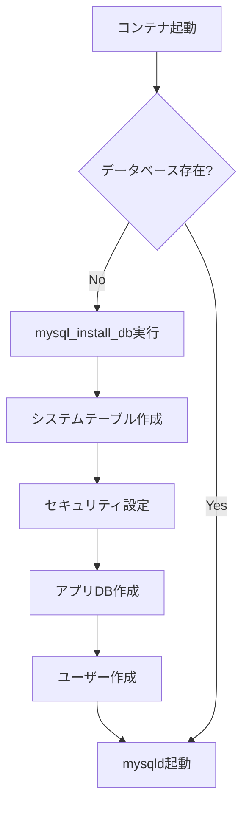

# MariaDB サービス詳細解説

## 目次
1. [Dockerfile解説](#dockerfile解説)
2. [create_db.shスクリプト解説](#create_dbshスクリプト解説)
3. [データベース初期化プロセス](#データベース初期化プロセス)
4. [セキュリティ設定](#セキュリティ設定)

## Dockerfile解説

```dockerfile
FROM alpine:3.21
```
**解説：**
- Alpine Linux 3.21をベースイメージとして使用
- 軽量でセキュアなLinuxディストリビューション
- MariaDBのパッケージサイズも最小限

```dockerfile
RUN apk update && apk add --no-cache mariadb mariadb-client
```
**解説：**
- `mariadb`: MariaDBサーバー本体
  - MySQLのフォークで、より活発な開発
  - GPLライセンスで完全オープンソース
- `mariadb-client`: MariaDBクライアントツール
  - mysql, mysqldump等のコマンドラインツール
  - データベース接続テストに必要

```dockerfile
RUN mkdir -p /var/run/mysqld \
    && chown -R mysql:mysql /var/run/mysqld \
    && chmod 777 /var/run/mysqld
```
**詳細解説：**

1. `mkdir -p /var/run/mysqld`
   - MySQLソケットファイル用ディレクトリ作成
   - `-p`: 親ディレクトリも必要に応じて作成

2. `chown -R mysql:mysql /var/run/mysqld`
   - ディレクトリ所有者をmysqlユーザーに変更
   - セキュリティ: 非rootユーザーでの実行

3. `chmod 777 /var/run/mysqld`
   - 全ユーザーに読み書き実行権限を付与
   - ソケットファイルへのアクセスを保証
   - 注意: 本番環境では755等、より制限的な権限を検討

```dockerfile
EXPOSE 3306
```
**解説：**
- MariaDBのデフォルトポート
- TCPポート3306を他のコンテナに公開
- ホストには公開されない（docker-compose.ymlで制御）

```dockerfile
COPY conf/create_db.sh /usr/local/bin/
RUN chmod +x /usr/local/bin/create_db.sh
```
**解説：**
- 初期化スクリプトをコンテナにコピー
- 実行権限を付与
- `/usr/local/bin/`: PATHに含まれるディレクトリ

```dockerfile
ENTRYPOINT ["/usr/local/bin/create_db.sh"]
```
**解説：**
- コンテナ起動時に必ず実行されるスクリプト
- データベースの初期化を担当
- CMDと組み合わせて使用

```dockerfile
CMD ["/usr/bin/mysqld", "--user=mysql", "--console", "--skip-networking=0", "--bind-address=0.0.0.0"]
```
**各オプションの詳細：**
- `/usr/bin/mysqld`: MariaDBデーモン本体
- `--user=mysql`: mysqlユーザーで実行（セキュリティ）
- `--console`: ログを標準出力に出力（Docker向け）
- `--skip-networking=0`: ネットワーク接続を有効化
- `--bind-address=0.0.0.0`: すべてのネットワークインターフェースでリッスン

## create_db.shスクリプト解説

### スクリプトの全体構造

```bash
#!/bin/sh
```
**解説：**
- シェバン行：/bin/shで実行
- Alpine Linuxではashシェルを使用（bashより軽量）

### データベース初期化チェック

```bash
if [ ! -d "/var/lib/mysql/mysql" ]; then
```
**解説：**
- MySQLシステムデータベースの存在確認
- 初回起動時のみ初期化を実行
- 再起動時は既存データを保持

### 権限設定

```bash
chown -R mysql:mysql /var/lib/mysql
```
**解説：**
- データディレクトリの所有者を設定
- mysqlユーザーがファイルを読み書きできるように

### データベース初期化

```bash
mysql_install_db --basedir=/usr --datadir=/var/lib/mysql --user=mysql --rpm
```
**各オプションの詳細：**
- `--basedir=/usr`: MariaDBのインストールディレクトリ
- `--datadir=/var/lib/mysql`: データファイルの保存場所
- `--user=mysql`: ファイル所有者
- `--rpm`: RPM用の設定（エラー出力を抑制）

### 一時ファイルの作成

```bash
tfile=`mktemp`
if [ ! -f "$tfile" ]; then
    return 1
fi
```
**解説：**
- `mktemp`: 安全な一時ファイルを作成
- SQLコマンドを一時的に保存
- セキュリティ: ランダムなファイル名で衝突を防ぐ

### 初期SQLコマンドの詳細

```sql
USE mysql;
FLUSH PRIVILEGES;
```
**解説：**
- mysqlシステムデータベースを選択
- 権限テーブルをリロード

#### セキュリティ強化設定

```sql
DELETE FROM mysql.user WHERE User='';
```
**解説：**
- 匿名ユーザーを削除
- セキュリティリスク: 誰でもログイン可能な状態を防ぐ

```sql
DROP DATABASE IF EXISTS test;
DELETE FROM mysql.db WHERE Db='test';
```
**解説：**
- testデータベースを削除
- デフォルトで作成される不要なデータベース
- セキュリティ: 攻撃者の足がかりを減らす

```sql
DELETE FROM mysql.user WHERE User='root' AND Host NOT IN ('localhost', '127.0.0.1', '::1');
```
**解説：**
- リモートからのroot接続を無効化
- ローカルホストからのみrootアクセス可能
- `::1`: IPv6のローカルホスト

#### rootパスワード設定

```sql
ALTER USER 'root'@'localhost' IDENTIFIED BY '$MYSQL_ROOT_PASSWORD';
```
**解説：**
- rootユーザーのパスワードを設定
- 環境変数から取得（セキュリティ）
- `ALTER USER`: MariaDB 10.2以降の推奨構文

#### アプリケーション用データベース作成

```sql
CREATE DATABASE IF NOT EXISTS $MYSQL_DATABASE CHARACTER SET utf8 COLLATE utf8_general_ci;
```
**詳細解説：**
- `IF NOT EXISTS`: 既存の場合はスキップ
- `CHARACTER SET utf8`: UTF-8エンコーディング
  - 注: utf8mb4の方が完全なUnicode対応（絵文字等）
- `COLLATE utf8_general_ci`: 照合順序
  - `ci`: case-insensitive（大文字小文字を区別しない）

#### アプリケーション用ユーザー作成

```sql
CREATE USER IF NOT EXISTS '$MYSQL_USER'@'%' IDENTIFIED BY '$MYSQL_PASSWORD';
GRANT ALL PRIVILEGES ON $MYSQL_DATABASE.* TO '$MYSQL_USER'@'%';
```
**解説：**
- `'$MYSQL_USER'@'%'`: 任意のホストから接続可能
  - `%`: ワイルドカード（すべてのホスト）
  - Docker内部ネットワークでの接続に必要
- `GRANT ALL PRIVILEGES`: 全権限を付与
  - CREATE, DROP, SELECT, INSERT, UPDATE, DELETE等
- `ON $MYSQL_DATABASE.*`: 特定データベースのみに限定

### ブートストラップモードでの実行

```bash
/usr/bin/mysqld --user=mysql --bootstrap < $tfile
rm -f $tfile
```
**解説：**
- `--bootstrap`: 特殊な初期化モード
  - ネットワークを無効化
  - 権限チェックをスキップ
  - SQLコマンドを直接実行
- 一時ファイルから SQLを読み込み
- 実行後、一時ファイルを削除（セキュリティ）

### プロセス引き継ぎ

```bash
exec "$@"
```
**解説：**
- `exec`: 現在のシェルプロセスを置き換え
- `"$@"`: CMDからの引数を展開（mysqldコマンド）
- PID 1として正しく動作（シグナル処理）

## データベース初期化プロセス

### 初回起動時のフロー



### 環境変数の役割

```yaml
# .envファイルでの設定例
MYSQL_ROOT_PASSWORD=rootpassword123    # rootユーザーのパスワード
MYSQL_DATABASE=wordpress_db             # 作成するデータベース名
MYSQL_USER=wp_user                      # アプリケーション用ユーザー
MYSQL_PASSWORD=wppassword123            # ユーザーパスワード
```

## セキュリティ設定

### 1. ユーザー権限の制限

```sql
-- 良い例：特定データベースのみ
GRANT ALL PRIVILEGES ON wordpress_db.* TO 'wp_user'@'%';

-- 悪い例：全データベースへのアクセス
GRANT ALL PRIVILEGES ON *.* TO 'wp_user'@'%';
```

### 2. ネットワークアクセス制限

```bash
# Docker内部ネットワークのみ
--bind-address=0.0.0.0  # コンテナ間通信に必要

# より制限的な設定（可能な場合）
--bind-address=172.20.0.2  # 特定のIPのみ
```

### 3. パスワードポリシー

推奨されるパスワード要件：
- 最小8文字以上
- 大文字・小文字・数字・記号を含む
- 辞書に載っている単語を避ける

### 4. 最小権限の原則

```sql
-- 読み取り専用ユーザーの例
CREATE USER 'reader'@'%' IDENTIFIED BY 'password';
GRANT SELECT ON wordpress_db.* TO 'reader'@'%';

-- 書き込み権限を持つユーザー
CREATE USER 'writer'@'%' IDENTIFIED BY 'password';
GRANT SELECT, INSERT, UPDATE, DELETE ON wordpress_db.* TO 'writer'@'%';
```

## パフォーマンスチューニング

### 基本的な設定（追加可能）

```ini
# /etc/my.cnf.d/mariadb-server.cnf
[mysqld]
# バッファプール（メモリキャッシュ）
innodb_buffer_pool_size = 128M

# クエリキャッシュ
query_cache_type = 1
query_cache_size = 16M

# 接続数
max_connections = 100

# スロークエリログ
slow_query_log = 1
slow_query_log_file = /var/log/mysql/slow.log
long_query_time = 2
```

## トラブルシューティング

### よくある問題と解決方法

#### 1. 接続エラー: "Can't connect to MySQL server"

**原因と解決：**
```bash
# ログ確認
docker logs mariadb

# ネットワーク確認
docker exec mariadb mysql -u root -p -e "SHOW VARIABLES LIKE 'bind_address';"

# ユーザー権限確認
docker exec mariadb mysql -u root -p -e "SELECT User, Host FROM mysql.user;"
```

#### 2. 権限エラー: "Access denied for user"

**原因と解決：**
```sql
-- ユーザーの存在確認
SELECT User, Host FROM mysql.user WHERE User='wp_user';

-- 権限の確認
SHOW GRANTS FOR 'wp_user'@'%';

-- 権限の再付与
GRANT ALL PRIVILEGES ON wordpress_db.* TO 'wp_user'@'%';
FLUSH PRIVILEGES;
```

#### 3. データベースが作成されない

**原因と解決：**
```bash
# 環境変数の確認
docker exec mariadb env | grep MYSQL

# 手動でデータベース作成
docker exec -it mariadb mysql -u root -p
CREATE DATABASE wordpress_db;
```

## ボリュームとデータ永続化

### データディレクトリ構造

```
/var/lib/mysql/
├── mysql/              # システムデータベース
├── performance_schema/ # パフォーマンス監視
├── wordpress_db/       # アプリケーションDB
├── ib_logfile0        # InnoDBログファイル
├── ib_logfile1        # InnoDBログファイル
└── ibdata1            # InnoDBデータファイル
```

### バックアップとリストア

```bash
# バックアップ
docker exec mariadb mysqldump -u root -p wordpress_db > backup.sql

# リストア
docker exec -i mariadb mysql -u root -p wordpress_db < backup.sql
```

## まとめ

MariaDBコンテナは以下の重要な役割を担います：

1. **データ永続化**: WordPressのコンテンツを保存
2. **セキュアな初期化**: 不要なユーザー・DBを削除
3. **環境変数による設定**: パスワードの安全な管理
4. **ネットワーク分離**: Docker内部ネットワークのみでアクセス
5. **自動初期化**: 初回起動時のみデータベースをセットアップ

このアーキテクチャにより、セキュアで保守性の高いデータベースサービスを実現しています。