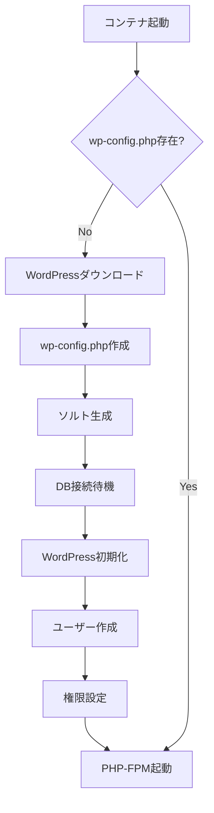

# WordPress + PHP-FPM サービス詳細解説

## 目次
1. [Dockerfile解説](#dockerfile解説)
2. [wp-config-docker.shスクリプト解説](#wp-config-dockershスクリプト解説)
3. [PHP-FPM設定の詳細](#php-fpm設定の詳細)
4. [WordPressインストールプロセス](#wordpressインストールプロセス)
5. [WP-CLIの活用](#wp-cliの活用)

## Dockerfile解説

### ベースイメージ

```dockerfile
FROM alpine:3.21
```
**解説：**
- Alpine Linux 3.21（penultimate stable）
- 最小限のフットプリントでPHP環境を構築

### PHP関連パッケージのインストール

```dockerfile
RUN apk update && apk add --no-cache \
    php83 \
    php83-fpm \
    php83-mysqli \
    php83-json \
    php83-curl \
    php83-dom \
    php83-exif \
    php83-fileinfo \
    php83-mbstring \
    php83-openssl \
    php83-xml \
    php83-zip \
    php83-redis \
    php83-phar \
    wget \
    tar \
    mysql-client
```

**各パッケージの役割：**

1. **php83**: PHP 8.3本体
   - 最新の安定版PHP
   - パフォーマンス改善とセキュリティ強化

2. **php83-fpm**: FastCGI Process Manager
   - NGINXとの連携に必須
   - プロセスプール管理

3. **php83-mysqli**: MySQL Improved Extension
   - MariaDB/MySQLデータベース接続
   - プリペアドステートメント対応

4. **php83-json**: JSON処理
   - REST API通信
   - WordPressのAjax機能

5. **php83-curl**: cURL拡張
   - 外部API通信
   - プラグインの更新チェック

6. **php83-dom**: DOM操作
   - XMLパース
   - HTMLの動的生成

7. **php83-exif**: EXIF情報読み取り
   - 画像メタデータ処理
   - 画像の自動回転

8. **php83-fileinfo**: ファイル情報
   - MIMEタイプ検出
   - セキュアなファイルアップロード

9. **php83-mbstring**: マルチバイト文字列
   - 日本語等の処理
   - UTF-8対応

10. **php83-openssl**: 暗号化機能
    - HTTPS通信
    - パスワードハッシュ化

11. **php83-xml**: XML処理
    - RSS/Atomフィード
    - XML-RPC

12. **php83-zip**: ZIP圧縮
    - プラグイン/テーマのインストール
    - バックアップ機能

13. **php83-redis**: Redis拡張（ボーナス用）
    - キャッシュシステム
    - セッション管理

14. **php83-phar**: PHARアーカイブ
    - WP-CLIの実行に必要

15. **wget**: ファイルダウンロード
    - WordPressコアのダウンロード

16. **tar**: アーカイブ処理
    - WordPressの展開

17. **mysql-client**: MySQLクライアント
    - データベース接続テスト

### PHP-FPM設定の修正

```dockerfile
RUN sed -i 's/listen = 127.0.0.1:9000/listen = 9000/g' /etc/php83/php-fpm.d/www.conf && \
    sed -i 's/;listen.owner = nobody/listen.owner = nobody/g' /etc/php83/php-fpm.d/www.conf && \
    sed -i 's/;listen.group = nobody/listen.group = nobody/g' /etc/php83/php-fpm.d/www.conf && \
    sed -i 's/;clear_env = no/clear_env = no/g' /etc/php83/php-fpm.d/www.conf && \
    echo 'php_admin_value[memory_limit] = 256M' >> /etc/php83/php-fpm.d/www.conf
```

**各設定の詳細解説：**

1. **listen = 9000**
   ```ini
   # 変更前: listen = 127.0.0.1:9000
   # 変更後: listen = 9000
   ```
   - TCPソケットでポート9000をリッスン
   - すべてのインターフェースで接続を受け付ける
   - Docker内部ネットワークでの通信に必要

2. **listen.owner = nobody**
   ```ini
   # ソケットファイルの所有者
   ```
   - Unixソケット使用時の所有者設定
   - セキュリティ: 非特権ユーザー

3. **listen.group = nobody**
   ```ini
   # ソケットファイルのグループ
   ```
   - Unixソケット使用時のグループ設定

4. **clear_env = no**
   ```ini
   # 環境変数をクリアしない
   ```
   - 環境変数をPHPプロセスに引き継ぐ
   - WordPressの設定に必要

5. **memory_limit = 256M**
   ```ini
   # PHPメモリ制限
   ```
   - WordPressの推奨値
   - 大きな画像処理やプラグインに必要

### WP-CLIのインストール

```dockerfile
RUN wget https://raw.githubusercontent.com/wp-cli/builds/gh-pages/phar/wp-cli.phar && \
    chmod +x wp-cli.phar && \
    mv wp-cli.phar /usr/local/bin/wp
```

**解説：**
- WP-CLI: WordPressコマンドラインツール
- PHARファイル形式（PHP Archive）
- `/usr/local/bin/wp`として配置（PATHに含まれる）

### 作業ディレクトリとスクリプト設定

```dockerfile
WORKDIR /var/www/html

COPY conf/wp-config-docker.sh /usr/local/bin/
RUN chmod +x /usr/local/bin/wp-config-docker.sh

EXPOSE 9000

ENTRYPOINT ["/usr/local/bin/wp-config-docker.sh"]
CMD ["/usr/sbin/php-fpm83", "-F"]
```

**解説：**
- `/var/www/html`: WordPressのドキュメントルート
- `EXPOSE 9000`: PHP-FPMのポート
- `ENTRYPOINT`: 初期化スクリプト
- `CMD`: PHP-FPMをフォアグラウンドで実行（`-F`オプション）

## wp-config-docker.shスクリプト解説

### 初期待機

```bash
#!/bin/sh
sleep 10
```
**解説：**
- MariaDBの起動を待つ
- シンプルだが確実な方法
- 改善案: ヘルスチェックの実装

### メモリ制限の設定

```bash
export WP_CLI_PHP_ARGS="-d memory_limit=512M"
```
**解説：**
- WP-CLI実行時のPHPメモリ制限
- 大規模なインポート/エクスポートに対応

### WordPressの存在チェック

```bash
if [ ! -f /var/www/html/wp-config.php ]; then
```
**解説：**
- wp-config.phpの存在確認
- 初回インストール時のみ実行
- 再起動時は既存の設定を保持

### WordPressコアのダウンロード

```bash
cd /var/www/html

# Download WordPress directly with wget (more reliable)
wget https://wordpress.org/latest.tar.gz
tar xzf latest.tar.gz
mv wordpress/* .
rmdir wordpress
rm latest.tar.gz
```

**処理の流れ：**
1. 最新版WordPressをダウンロード
2. tar.gzファイルを展開
3. wordpressディレクトリの中身を移動
4. 空のディレクトリとアーカイブを削除

**なぜWP-CLIではなくwget？**
- より確実なダウンロード
- ネットワークエラーへの耐性
- メモリ使用量の削減

### wp-config.phpの作成

```bash
cp wp-config-sample.php wp-config.php

# Update database configuration
sed -i "s/database_name_here/$WORDPRESS_DB_NAME/g" wp-config.php
sed -i "s/username_here/$WORDPRESS_DB_USER/g" wp-config.php
sed -i "s/password_here/$WORDPRESS_DB_PASSWORD/g" wp-config.php
sed -i "s/localhost/$WORDPRESS_DB_HOST/g" wp-config.php
```

**各sedコマンドの詳細：**
- データベース名の置換
- ユーザー名の置換
- パスワードの置換
- ホスト名の置換（localhost → mariadb:3306）

### セキュリティソルトの追加

```bash
SALT=$(wget -qO- https://api.wordpress.org/secret-key/1.1/salt/)
sed -i "/put your unique phrase here/d" wp-config.php
echo "$SALT" >> wp-config.php
```

**解説：**
- WordPress公式APIからランダムなソルトを取得
- セキュリティ: セッションのハイジャック防止
- クッキーの暗号化強化

**生成されるソルトの例：**
```php
define('AUTH_KEY',         'ランダムな文字列');
define('SECURE_AUTH_KEY',  'ランダムな文字列');
define('LOGGED_IN_KEY',    'ランダムな文字列');
define('NONCE_KEY',        'ランダムな文字列');
define('AUTH_SALT',        'ランダムな文字列');
define('SECURE_AUTH_SALT', 'ランダムな文字列');
define('LOGGED_IN_SALT',   'ランダムな文字列');
define('NONCE_SALT',       'ランダムな文字列');
```

### データベース接続待機

```bash
while ! mysqladmin ping -h mariadb -u $WORDPRESS_DB_USER -p$WORDPRESS_DB_PASSWORD --silent; do
    echo "Waiting for database..."
    sleep 5
done
```

**解説：**
- `mysqladmin ping`: データベースの応答確認
- `-h mariadb`: Docker内部DNSでホスト解決
- `--silent`: 成功時に出力なし
- 5秒ごとにリトライ

### リトライ機能付きコマンド実行

```bash
retry_wp_command() {
    local cmd="$1"
    local retries=3
    while [ $retries -gt 0 ]; do
        if eval "$cmd"; then
            return 0
        else
            echo "Command failed, retrying... ($retries attempts left)"
            retries=$((retries - 1))
            sleep 5
        fi
    done
    echo "Command failed after all retries: $cmd"
    return 1
}
```

**解説：**
- 最大3回のリトライ
- ネットワークエラーへの対処
- データベース接続の不安定性への対応

### WordPressのインストール

```bash
retry_wp_command "wp core install \
    --url=https://$DOMAIN_NAME \
    --title='$WORDPRESS_TITLE' \
    --admin_user=$WORDPRESS_ADMIN_USER \
    --admin_password=$WORDPRESS_ADMIN_PASSWORD \
    --admin_email=$WORDPRESS_ADMIN_EMAIL \
    --skip-email \
    --allow-root"
```

**各オプションの詳細：**
- `--url`: サイトのURL（HTTPS必須）
- `--title`: サイトタイトル
- `--admin_user`: 管理者ユーザー名（adminは禁止）
- `--admin_password`: 管理者パスワード
- `--admin_email`: 管理者メールアドレス
- `--skip-email`: インストール通知メールをスキップ
- `--allow-root`: rootユーザーでの実行を許可

### 一般ユーザーの作成

```bash
retry_wp_command "wp user create \
    $WORDPRESS_USER \
    $WORDPRESS_USER_EMAIL \
    --role=author \
    --user_pass=$WORDPRESS_USER_PASSWORD \
    --allow-root"
```

**ユーザーロールの種類：**
- **administrator**: 全権限
- **editor**: 記事の編集・公開
- **author**: 自分の記事の編集・公開 ← 選択
- **contributor**: 記事の下書き
- **subscriber**: 閲覧のみ

### 権限設定

```bash
chown -R nobody:nobody /var/www/html
```

**解説：**
- nobodyユーザーに所有権を変更
- PHP-FPMの実行ユーザーと一致
- セキュリティ: 最小権限の原則

### プロセスの引き継ぎ

```bash
exec "$@"
```

**解説：**
- CMDからのコマンドを実行（php-fpm83）
- PID 1として実行
- シグナルを正しく処理

## PHP-FPM設定の詳細

### プロセスマネージャー設定

```ini
; /etc/php83/php-fpm.d/www.conf

[www]
; プロセス管理方式
pm = dynamic

; 最大子プロセス数
pm.max_children = 5

; 起動時の子プロセス数
pm.start_servers = 2

; アイドル時の最小プロセス数
pm.min_spare_servers = 1

; アイドル時の最大プロセス数
pm.max_spare_servers = 3
```

**プロセス管理モードの選択肢：**
1. **static**: 固定数のプロセス
2. **dynamic**: 動的に調整（デフォルト）
3. **ondemand**: リクエスト時に起動

### パフォーマンスチューニング

```ini
; リクエストのタイムアウト
request_terminate_timeout = 30

; スロークエリログ
request_slowlog_timeout = 5
slowlog = /var/log/php-fpm/slow.log

; ステータスページ
pm.status_path = /status
ping.path = /ping
```

## WordPressインストールプロセス

### インストールフロー



### 環境変数の役割

```yaml
# WordPressの設定
WORDPRESS_DB_HOST=mariadb:3306        # データベースホスト
WORDPRESS_DB_USER=wp_user              # DBユーザー
WORDPRESS_DB_PASSWORD=wppassword123    # DBパスワード
WORDPRESS_DB_NAME=wordpress_db         # データベース名
WORDPRESS_TITLE=Inception              # サイトタイトル
WORDPRESS_ADMIN_USER=wpmanager         # 管理者ユーザー名
WORDPRESS_ADMIN_PASSWORD=adminpass123  # 管理者パスワード
WORDPRESS_ADMIN_EMAIL=admin@example.com # 管理者メール
WORDPRESS_USER=hauchida                # 一般ユーザー名
WORDPRESS_USER_EMAIL=user@example.com  # 一般ユーザーメール
WORDPRESS_USER_PASSWORD=userpass123    # 一般ユーザーパスワード
```

## WP-CLIの活用

### 基本的なコマンド

```bash
# プラグイン管理
wp plugin list
wp plugin install akismet --activate
wp plugin update --all

# テーマ管理
wp theme list
wp theme install twentytwentythree --activate

# ユーザー管理
wp user list
wp user create john john@example.com --role=editor

# データベース操作
wp db export backup.sql
wp db import backup.sql
wp db optimize

# キャッシュ管理
wp cache flush
wp transient delete --all
```

### メンテナンスモード

```bash
# メンテナンスモード有効化
wp maintenance-mode activate

# メンテナンスモード無効化
wp maintenance-mode deactivate
```

## セキュリティ設定

### wp-config.phpの追加設定

```php
// デバッグモード（本番環境では無効化）
define('WP_DEBUG', false);
define('WP_DEBUG_LOG', false);
define('WP_DEBUG_DISPLAY', false);

// ファイル編集の無効化
define('DISALLOW_FILE_EDIT', true);

// 自動更新の設定
define('WP_AUTO_UPDATE_CORE', false);

// SSL強制
define('FORCE_SSL_ADMIN', true);

// ファイルアップロード制限
define('ALLOW_UNFILTERED_UPLOADS', false);
```

### ファイルパーミッション

```bash
# 推奨されるパーミッション
find /var/www/html -type d -exec chmod 755 {} \;
find /var/www/html -type f -exec chmod 644 {} \;
chmod 600 wp-config.php
```

## トラブルシューティング

### よくある問題と解決方法

#### 1. "Error establishing a database connection"

**原因と解決：**
```bash
# 環境変数の確認
docker exec wordpress env | grep WORDPRESS_DB

# データベース接続テスト
docker exec wordpress mysql -h mariadb -u wp_user -p

# wp-config.phpの確認
docker exec wordpress cat wp-config.php | grep DB_
```

#### 2. "The uploaded file exceeds the upload_max_filesize"

**解決方法：**
```ini
; php.iniに追加
upload_max_filesize = 64M
post_max_size = 64M
max_execution_time = 300
```

#### 3. メモリエラー

**解決方法：**
```php
// wp-config.phpに追加
define('WP_MEMORY_LIMIT', '256M');
define('WP_MAX_MEMORY_LIMIT', '512M');
```

## パフォーマンス最適化

### OPcache設定

```ini
; OPcache有効化
opcache.enable=1
opcache.memory_consumption=128
opcache.interned_strings_buffer=8
opcache.max_accelerated_files=4000
opcache.revalidate_freq=60
```

### オブジェクトキャッシュ（Redis連携）

```php
// wp-config.phpに追加
define('WP_REDIS_HOST', 'redis');
define('WP_REDIS_PORT', 6379);
define('WP_CACHE', true);
```

## まとめ

WordPress + PHP-FPMコンテナは以下の重要な機能を提供：

1. **自動インストール**: 環境変数による自動セットアップ
2. **PHP-FPM**: 効率的なPHP実行環境
3. **WP-CLI統合**: コマンドラインでの管理
4. **セキュリティ**: 適切な権限設定とソルト生成
5. **リトライ機能**: ネットワークエラーへの対応
6. **環境分離**: コンテナ化による独立性

このアーキテクチャにより、スケーラブルで保守性の高いWordPress環境を実現しています。